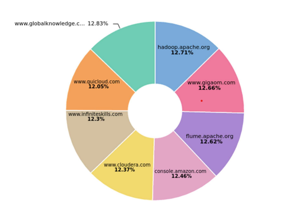

# access-log-analyzer

In this project, we analyze Apache Server Access Logs using Spark SQL Structured Streaming, and ELK stack (Elasticsearch, Logstash, Kibana). The access logs are generated using a Python script.
 

  

 
Using Kibana UI for visualization we get the following results:

  <h3>Visited websites counts :</h3>
  
  <h3>Status code counts :</h3>
  

 
Side Note:
  
  - The proportions in the pie charts are equal since the python random function, used in generating the access logs, uses an uniform distribution to generate random results. So we except the results to have same occurrences when the number of access logs is high.

